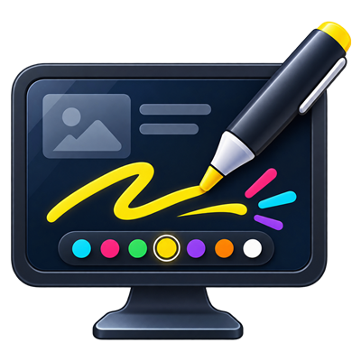
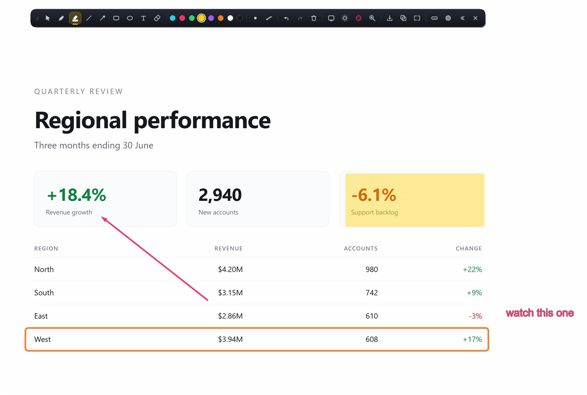
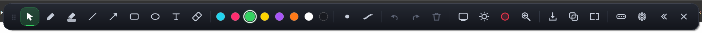
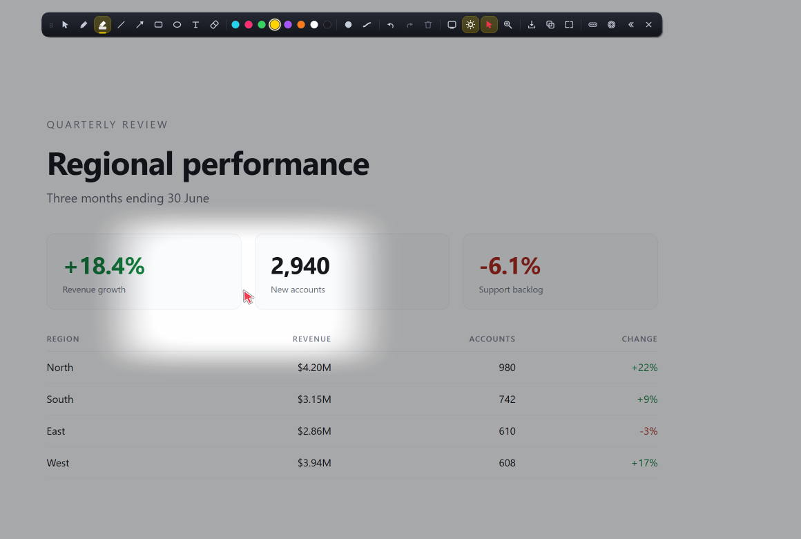
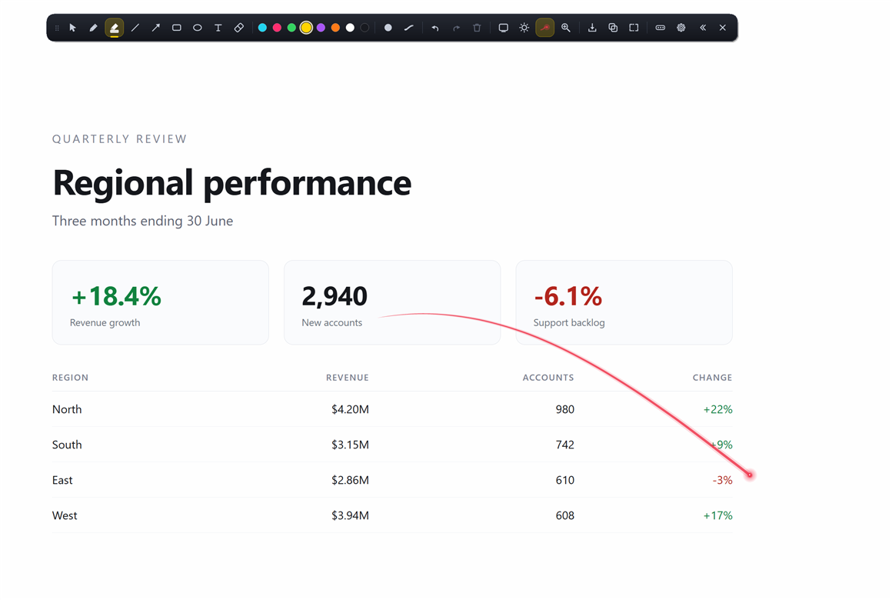
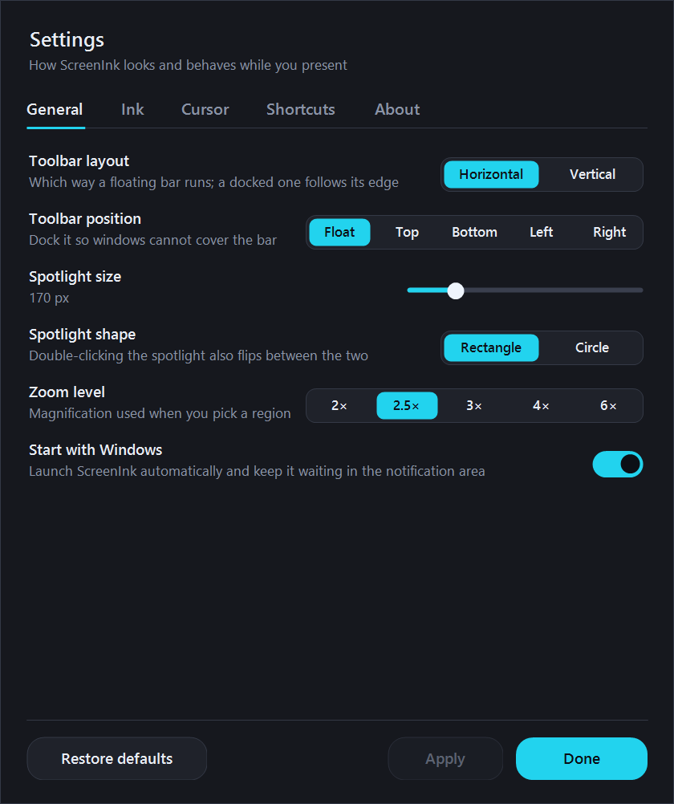
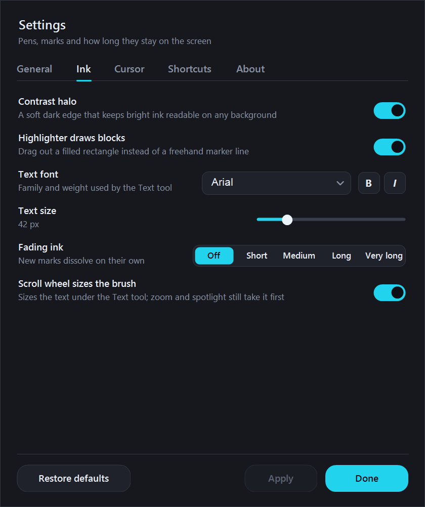
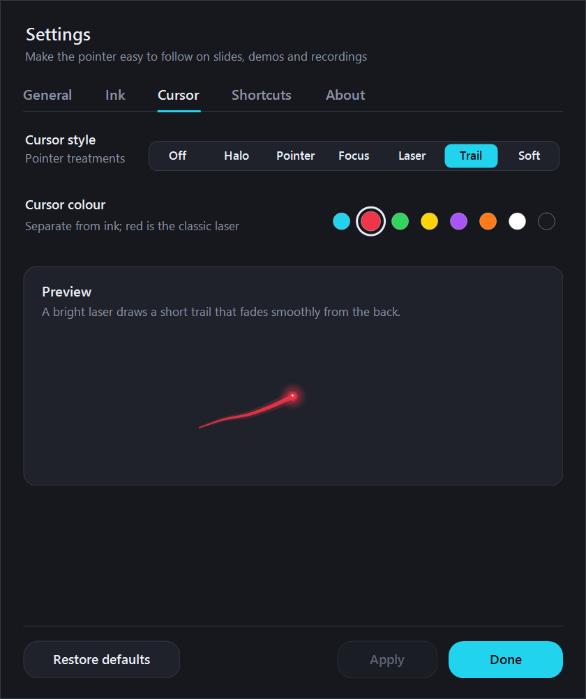
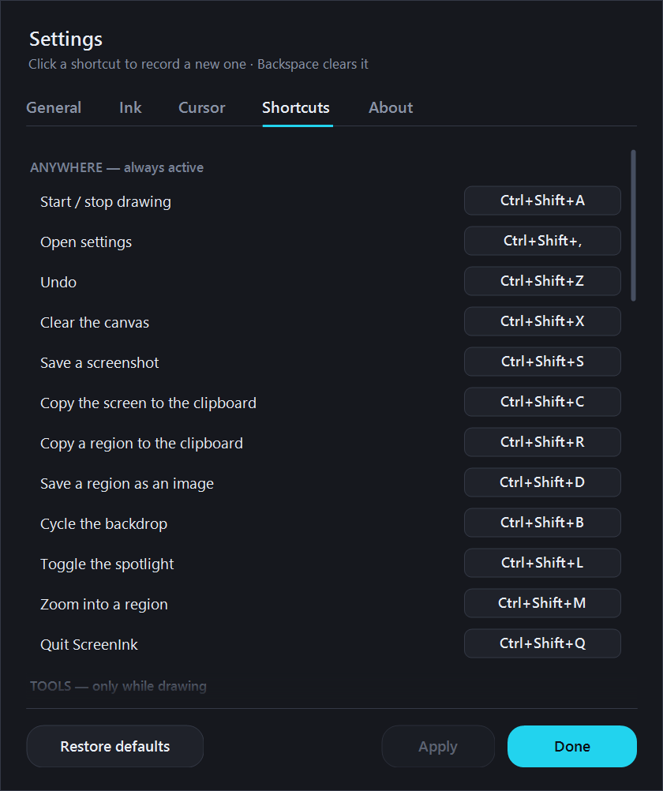
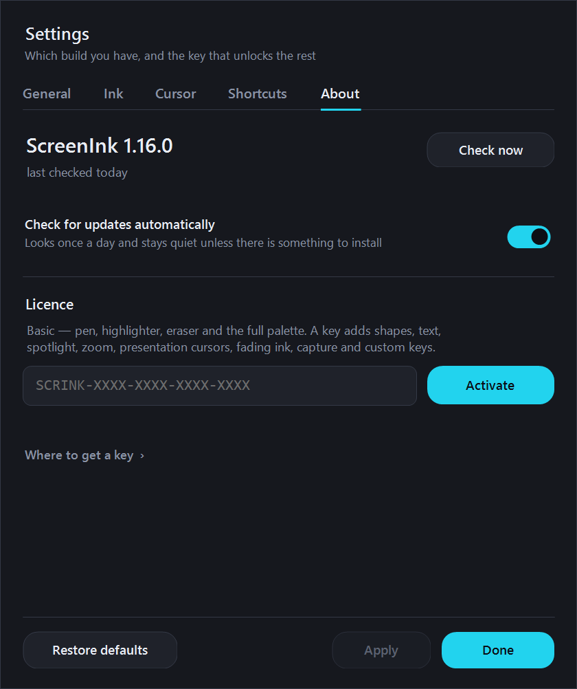

<div align="center">



# ScreenInk

**Draw on your screen while you present.**

Pen, highlighter, arrows, shapes and captions over anything on your screen — slides, a browser, a
terminal, a live demo. Plus a spotlight, region zoom and a laser-trail pointer for the moments when
a drawing is not what you need.

### [⬇ Download for Windows](https://github.com/alexusa75/ScreenInk-releases/releases/latest)

Windows 10 and 11 · per-user install, no administrator prompt · self-contained, no prerequisites

<br>



</div>

---

## Why it exists

Most annotation tools take the screen hostage. They grab the keyboard, they cover the taskbar, they
make you leave your slides to change colour, and when you finally hit Escape your presenter view has
lost focus and your clicker no longer advances anything.

ScreenInk is built the other way round. The overlay only becomes interactive when you actually pick
a tool. With the pointer selected, every click, scroll and keystroke goes straight through to the
application underneath, so the ink sits on top of a deck you are still driving normally. One hotkey
gets you drawing, another gets you out.

- **Every monitor, one canvas.** The overlay spans the whole virtual desktop; draw an arrow that
  starts on one screen and ends on another.
- **Per-pixel transparency.** Real anti-aliased strokes with a soft contrast halo, so bright ink
  stays readable on a white slide and a dark terminal alike.
- **Never in the way.** Dock the toolbar to any edge or float it anywhere, run it horizontally or
  vertically, collapse it, or close it to the notification area and call it back with a hotkey.
- **Nothing to sign in to.** No account, no telemetry, no background service.

---

## The toolbar

<div align="center"></div>

Left to right: pointer, pen, highlighter, line, arrow, rectangle, ellipse, text, eraser · the
colour palette · stroke width and fading ink · undo, redo, clear · backdrop, spotlight,
presentation cursor, zoom · save, copy, capture a region · more, settings, collapse, close.

Grab the dotted handle on the left to drag the bar anywhere; drop it against an edge to dock it.
Every button shows its keyboard shortcut on hover.

---

## A tour

### Draw

Press <kbd>Ctrl</kbd>+<kbd>Shift</kbd>+<kbd>A</kbd> anywhere to start drawing, and again to stop.
Then single letters do the work: <kbd>P</kbd> pen, <kbd>H</kbd> highlighter, <kbd>L</kbd> line,
<kbd>A</kbd> arrow, <kbd>R</kbd> rectangle, <kbd>O</kbd> ellipse, <kbd>T</kbd> text,
<kbd>E</kbd> eraser, <kbd>1</kbd>–<kbd>8</kbd> for colours.

While you drag a shape:

| | |
|---|---|
| <kbd>Shift</kbd> | constrain — square, circle, or a line snapped to 15° |
| <kbd>Ctrl</kbd> | draw the rectangle or ellipse from its centre |
| <kbd>Alt</kbd> | fill the shape instead of outlining it |
| scroll wheel | thicker or thinner stroke, live |

The highlighter can lay down a freehand marker line or drag out a translucent block —
<kbd>Shift</kbd>+<kbd>H</kbd> flips between them.

### Type on the screen

Pick the text tool, click where you want the caption and start typing. The caption stays live: drag
it to move it, scroll to resize it, click away to commit. <kbd>Esc</kbd> cancels.

### Let it fade

Fading ink dissolves each mark a few seconds after you finish it, so you can scribble over a demo
without ever stopping to clear the screen. Off, Short, Medium, Long or Very long —
<kbd>F</kbd> cycles it.

### Spotlight

<div align="center"></div>

<kbd>S</kbd> dims everything except a soft-edged window that follows your mouse. Scroll to resize
it, double-click to switch between a 16:9 rectangle and a circle. <kbd>B</kbd> cycles a full
backdrop instead: dimmed, white or black — a white board turns the overlay into a whiteboard.

### Presentation cursors

<div align="center"></div>

Replace the Windows arrow with something an audience can actually follow on a compressed video
call: a halo, a large pointer, a focus ring, a laser dot, a smooth fading laser trail, or a soft
spotlight that travels with the mouse. Pick the colour separately from your ink.

### Zoom

<kbd>Z</kbd> lets you drag out a region and magnifies it in place — 2× to 6×. Drag to pan, scroll
to change the magnification, and you can keep drawing while zoomed in.

### Capture

<kbd>Ctrl</kbd>+<kbd>Shift</kbd>+<kbd>C</kbd> copies the annotated screen to the clipboard,
<kbd>Ctrl</kbd>+<kbd>Shift</kbd>+<kbd>S</kbd> saves it as a PNG, and
<kbd>Ctrl</kbd>+<kbd>Shift</kbd>+<kbd>R</kbd> gives you a Windows-style region snip that includes
your ink.

---

## Settings

<div align="center">


</div>
<div align="center">


</div>

<kbd>Ctrl</kbd>+<kbd>Shift</kbd>+<kbd>,</kbd> opens Settings, or right-click the notification-area
icon. Every keyboard shortcut is rebindable: click one, press the combination you want,
<kbd>Backspace</kbd> clears it. Conflicts are flagged before you can save them.

### Default shortcuts

**Anywhere — active even when you are not drawing**

| | |
|---|---|
| <kbd>Ctrl</kbd>+<kbd>Shift</kbd>+<kbd>A</kbd> | start / stop drawing |
| <kbd>Ctrl</kbd>+<kbd>Shift</kbd>+<kbd>,</kbd> | open settings |
| <kbd>Ctrl</kbd>+<kbd>Shift</kbd>+<kbd>Z</kbd> | undo |
| <kbd>Ctrl</kbd>+<kbd>Shift</kbd>+<kbd>X</kbd> | clear the canvas |
| <kbd>Ctrl</kbd>+<kbd>Shift</kbd>+<kbd>S</kbd> / <kbd>C</kbd> | save / copy the screen |
| <kbd>Ctrl</kbd>+<kbd>Shift</kbd>+<kbd>D</kbd> / <kbd>R</kbd> | save / copy a region |
| <kbd>Ctrl</kbd>+<kbd>Shift</kbd>+<kbd>B</kbd> | cycle the backdrop |
| <kbd>Ctrl</kbd>+<kbd>Shift</kbd>+<kbd>L</kbd> | toggle the spotlight |
| <kbd>Ctrl</kbd>+<kbd>Shift</kbd>+<kbd>M</kbd> | zoom into a region |
| <kbd>Ctrl</kbd>+<kbd>Shift</kbd>+<kbd>Q</kbd> | quit |

**While drawing**

| | |
|---|---|
| <kbd>P</kbd> <kbd>H</kbd> <kbd>L</kbd> <kbd>A</kbd> <kbd>R</kbd> <kbd>O</kbd> <kbd>T</kbd> <kbd>E</kbd> | pen, highlighter, line, arrow, rectangle, ellipse, text, eraser |
| <kbd>1</kbd>–<kbd>8</kbd> | cyan, pink, green, yellow, purple, orange, white, black |
| <kbd>[</kbd> <kbd>]</kbd> | thinner / thicker |
| <kbd>Ctrl</kbd>+<kbd>Z</kbd> / <kbd>Ctrl</kbd>+<kbd>Y</kbd> / <kbd>Del</kbd> | undo / redo / clear |
| <kbd>F</kbd> | cycle fading-ink speed |
| <kbd>B</kbd> <kbd>S</kbd> <kbd>Z</kbd> | backdrop, spotlight, zoom |
| <kbd>Shift</kbd>+<kbd>V</kbd> | toolbar horizontal / vertical |
| <kbd>C</kbd> / <kbd>Shift</kbd>+<kbd>C</kbd> | copy / save a region |
| <kbd>Esc</kbd> | step back, then back to the pointer |

---

## Installing

Download `ScreenInk-<version>-x64.msi` from the
[latest release](https://github.com/alexusa75/ScreenInk-releases/releases/latest) and run it. The
installer is per-user, so Windows will not ask for an administrator. To install silently:

```powershell
msiexec /i ScreenInk-1.16.0-x64.msi /qn
```

Your settings live in `%APPDATA%\ScreenInk` and survive upgrades and removals.

### Updating

ScreenInk keeps itself up to date. It looks once a day, quietly, and tells you only when there is
something to install. **Settings ▸ About** shows the build you have, offers **Check now**, and
installs an update in place — it downloads the installer, verifies it against the checksum
published here, closes, upgrades and restarts itself. Your settings, custom shortcuts and
activation all carry over, and "Start with Windows" keeps whatever you set it to.

If an automatic update ever fails, ScreenInk comes back on the old build and says so; download the
MSI from the release page and run it by hand.

You can turn the daily check off in **Settings ▸ About**.

### Removing it

Settings ▸ Apps ▸ ScreenInk ▸ Uninstall. If Windows Installer refuses — a few machines fail on
their own rollback folder with `Could not set file security … Error: 5` — grab
`Remove-ScreenInk.ps1` from the release assets, which gets past that and cleans up by hand.

---

<a name="pro"></a>

## Basic and Pro

ScreenInk is free to install, and free to keep using as an annotator. An activation key unlocks
the presentation features on top.

<div align="center"></div>

<sup>On Basic, the locked buttons stay visible with a small amber marker rather than disappearing —
you can always see what a key would add.</sup>

| | Basic | Pro |
|---|:---:|:---:|
| Pen, highlighter, eraser | ● | ● |
| Full colour palette and stroke widths | ● | ● |
| Undo, redo, clear | ● | ● |
| Draw across every monitor | ● | ● |
| Dockable toolbar and global hotkeys | ● | ● |
| Automatic updates | ● | ● |
| Lines, arrows, rectangles, ellipses | | ● |
| Typed captions | | ● |
| Spotlight, and white, black and dimmed backdrops | | ● |
| Region zoom | | ● |
| Presentation cursors and the laser trail | | ● |
| Fading ink | | ● |
| Save and copy the screen or a region | | ● |
| Custom keyboard shortcuts | | ● |

### Activating a key

<div align="center"></div>

Paste the key into **Settings ▸ About** and press **Activate**. Case and dashes do not matter.

Activation needs the internet once. After that ScreenInk works offline for months and re-confirms
quietly once a day, so a key that is withdrawn stops working promptly and ScreenInk tells you why.
**Check now** on the About tab verifies the key immediately. A key is not tied to one machine — activate it on your laptop, your
desktop and the meeting-room PC. **Deactivate** on the About tab returns that machine to Basic.

`keys.json` in this repository records the SHA-256 of every key issued. A hash cannot be turned
back into a key, so publishing it gives nothing away; it is what lets ScreenInk confirm a key is
genuine, and what lets a lost or misused key be withdrawn.

---

## Questions

**Does it capture or record anything?** No. There is no telemetry, no account and no background
service. The only network call ScreenInk ever makes is to this repository, to look for a newer
version and to confirm an activation key.

**Will it steal focus from my slides?** No. With the pointer tool selected the overlay is
completely click-through — your clicker, arrow keys and mouse all reach PowerPoint as usual. It
only becomes interactive once you pick a drawing tool.

**Can I draw over a video call?** Yes, and the ink appears in a shared screen. Some
hardware-accelerated players draw straight to the display and will show through the overlay in a
recording; if that happens, disable hardware acceleration in that app.

**Where did my toolbar go?** Closing the toolbar leaves ScreenInk running in the notification area.
Click the icon to bring it back, or right-click it and choose Exit to quit for real.

**It crashed.** ScreenInk writes `%APPDATA%\ScreenInk\crash.log` with the stack, the build and the
monitor layout at the time. Attach it to an issue here — that file is usually the difference
between a fix and a guess.

---

## Changelog

Full history in [CHANGELOG.md](CHANGELOG.md).

---

<div align="center">
<sub>This repository holds the installers, the update feed and the key registry. The source lives
elsewhere.</sub>
</div>
